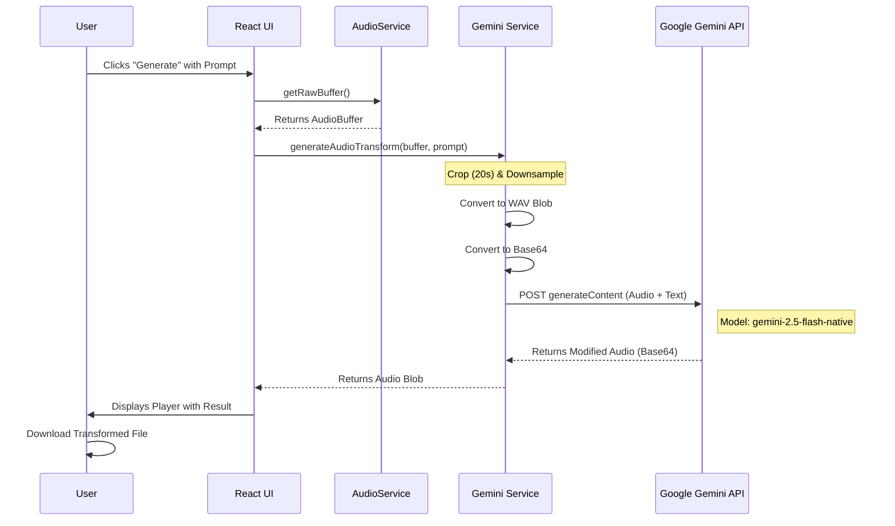

# 1. Overview

Sonic Forge is a web-based digital audio workstation (DAW) that combines traditional sound engineering (equalization, visualization) with the modern capabilities of Google's Gemini Generative AI. The application allows users to upload audio files, apply real-time frequency corrections, visualize the sound spectrum, and transform audio using text prompts.

## Technology Stack

- **Frontend**: React 19, Vite, Tailwind CSS.
- **Audio Engine**: Web Audio API (Browser Native).
- **Generative AI**: Google GenAI SDK (gemini-2.5-flash-native-audio-preview).
- **Language**: TypeScript.

# 2. Architecture and Data Flows

The application's core resides in the `AudioService`, which manages the audio context and the graph of processing nodes. Below are the detailed visual flows.

## Flow 1: Audio Processing Pipeline (DSP)

This diagram illustrates how audio flows from file loading to the output for speakers and the visualizer.

```mermaid
graph LR
    A[Audio File (MP3/WAV)] -->|Decode| B(AudioBuffer Source)
    B --> C{Equalizer (10 Bands)}

    subgraph "Filter Chain (BiquadFilterNodes)"
    C --> D[60Hz - LowShelf]
    D --> E[170Hz - Peaking]
    E --> F[... Mid Bands ...]
    F --> G[14kHz - Peaking]
    G --> H[16kHz - HighShelf]
    end

    H --> I(Gain Node)
    I --> J(Analyser Node)
    J --> K((Speakers / Destination))

    J -.->|Frequency Data| L[Visualizer Canvas]

    style C fill:#2d3748,stroke:#00f3ff,stroke-width:2px
    style L fill:#111827,stroke:#bc13fe,stroke-width:2px
```

## Flow 2: Generative AI Transformation

This flow details the process of sending an audio snippet to the Gemini model and receiving the transformed version.


